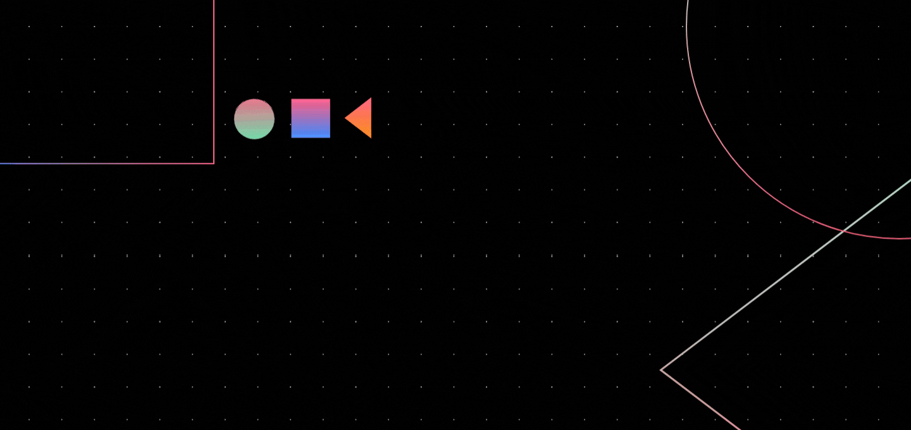

# Foodnetic

<p align="center">
   
</p>

[](https://GitHub.com/Naereen/StrapDown.js/graphs/commit-activity)

<!-- ABOUT THE PROJECT -->
## Built With

- Flutter
- Dart

---

## 🔥 Screenshots

| Mockup-1 |
| - |
|  |
|  |
|  |
|  |

<!-- BUILT WITH -->  

## How to Install Locally

**1. Fork and clone this repository using**

   ```
   git clone https://github.com/soumyadeep6845/Meals-App.git
   cd Meals-App/
   ```  

**2. Run the app in the way [your IDE describes](https://flutter.dev/docs/get-started/test-drive). You should see either Android, iOS, or web output, depending on your device.**  

---

## Contributing

If you'd like to contribute, please **fork** the repository and then raise a PR with necessary changes. Thank you.

---

## 🤎 Found this project interesting?

If you found this project useful, then please consider leaving a :star: on Github
and sharing it with your friends via social media.

---

## :man: Project Created & Maintained By-
  - [Soumyadeep Das](https://www.linkedin.com/in/soumya0021/)
